# Frogbot v3 — SAST diff-scan behavior matrix

Each pull request in this repository isolates one kind of change and shows, end to end, what a
Frogbot v3 `scan-pull-request` reports for it. Runtime: `jfrog/frogbot@v3` (latest release) against
a JAS-entitled JFrog platform, SAST enabled via the tenant's default config profile, and a
`gitRepository` watch + SAST policy so violations are generated, not just vulnerabilities.

## Baseline (main)

Two cross-file taint flows share one sink, plus one self-contained finding:

| # | Flow | Finding location |
|---|------|------------------|
| F1 | `Entry.readEnvTarget` (env) → `Middle.pass` → `Sink.exec` | `Sink.java:5` |
| F2 | `Entry.readPropertyTarget` (property) → `Middle.pass` → `Sink.exec` | `Sink.java:5` |
| F3 | `Legacy.archive` — env → exec, single file | `Legacy.java:6` |

F3 exists only as a canary: no case ever touches `Legacy.java` or anything on its flow, so any PR
that reports it proves the diff baseline was lost and the whole tree was reported.

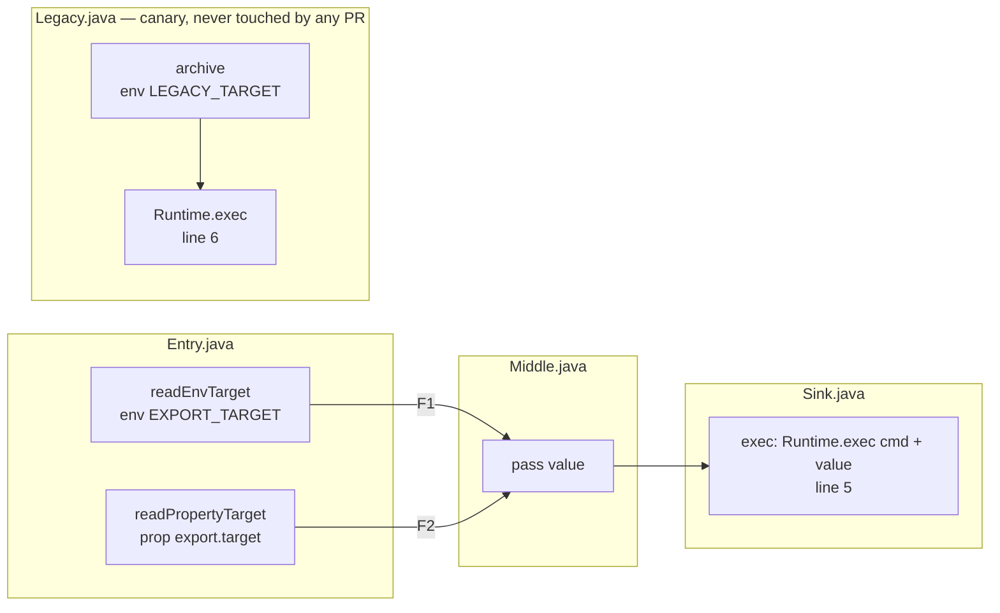

A PR scan should report **only what the PR introduces**. The engine diffs by each result's
`significant_full_path` fingerprint (a hash over the flow), and a finding is always *located at its
sink* — those two facts drive every outcome below.

## Cases

| PR | Case | Change | Files touched | Hypothesis |
|----|------|--------|---------------|------------|
| 1 | control-unrelated | edit docs file | docs | nothing reported |
| 2 | control-new-vuln | add self-contained vulnerable file | new file | 1 finding on the new file |
| 3 | add-source | new source feeding existing flow | `Entry.java` | 1 new finding at `Sink.java` (untouched) |
| 4 | remove-source | delete source F2 | `Entry.java` | nothing reported |
| 5 | modify-middle | edit statement inside `Middle.pass` | `Middle.java` | F1+F2 resurface at `Sink.java` (untouched) |
| 6 | benign-middle | add unrelated method to `Middle` | `Middle.java` | nothing reported |
| 7 | modify-sink | edit the sink statement | `Sink.java` | F1+F2 reported |
| 8 | remove-sink | delete the exec call | `Sink.java` | nothing reported |
| 9 | add-flow-middle | new route through `Middle` to `Sink` | `Entry.java`, `Middle.java` | 1 new finding at `Sink.java` |
| 10 | tech-change | add `requirements.txt` only | new file | **baseline loss**: all 3 findings incl. canary F3 |
| 11 | sink-line-shift | benign method above the sink | `Sink.java` | fingerprint stable → nothing reported |
| 12 | rename-middle | `Middle.java` → `Forwarder.java` | rename | F1+F2 resurface at `Sink.java` |

Case 10 targets `SearchTargetResultsByRelativePath` (jfrog-cli-security `utils/results/common.go`):
a technology-set mismatch between the branches drops the baseline silently, and
`newSastScanManager` treats a missing baseline as "not a diff scan".

## Reading a result

Per PR: the Frogbot comment (findings + violations sections), and the workflow debug log —
`Diff mode - SAST results to compare provided` present/absent, `No target found`, and the
`roots:` list of the scanner input.

## The flows, case by case

Legend: <span>🟩 added</span> · 🟥 removed (dashed) · 🟨 modified · thick red border = where the scan reports a finding.

### Case 1 — control: unrelated docs change

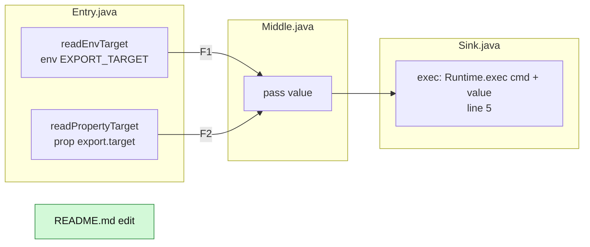

**Result: green banner.** Nothing on any flow changed.

### Case 2 — control: new self-contained vulnerability

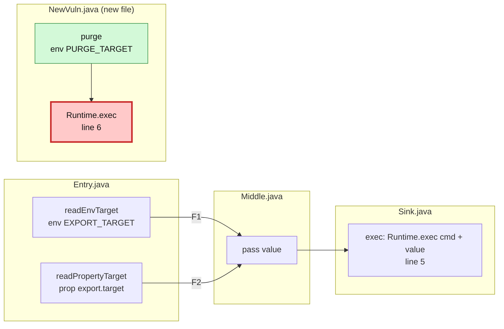

**Result: 1 finding, inline review comment on `NewVuln.java:6`** — the file is part of the diff, so the comment lands on the line itself.

### Case 3 — add a source

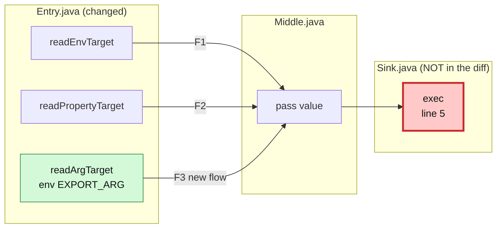

**Result: 1 new finding reported at `Sink.java:5` — a file the PR never touched.** A finding is always located at its sink; only the new flow F3 is reported, F1/F2 stay suppressed.

### Case 4 — remove a source

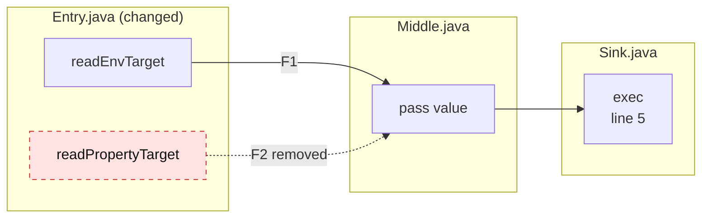

**Result: green banner.** A finding that disappears produces no comment.

### Case 5 — modify code in the middle of the flow

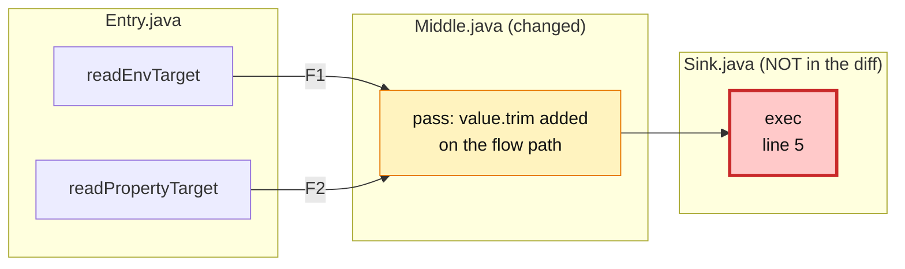

**Result: the pre-existing finding resurfaces at `Sink.java:5` — untouched file.** The fingerprint hashes the flow content, so editing any statement on the path makes an old flow look new. This is the main noise amplifier.

### Case 6 — benign change in a flow file

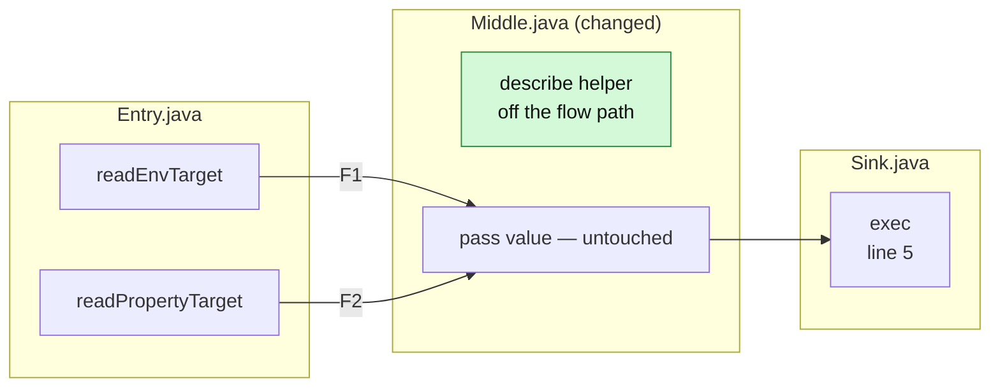

**Result: green banner.** The fingerprint is not line-sensitive — shifting the flow down the file changes nothing.

### Case 7 — modify code in the sink

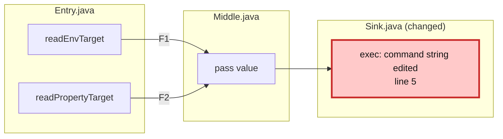

**Result: findings re-reported, inline review comment on `Sink.java:5`.** Same resurfacing as case 5, but the file is in the diff so it reads as expected to the developer.

### Case 8 — remove the sink

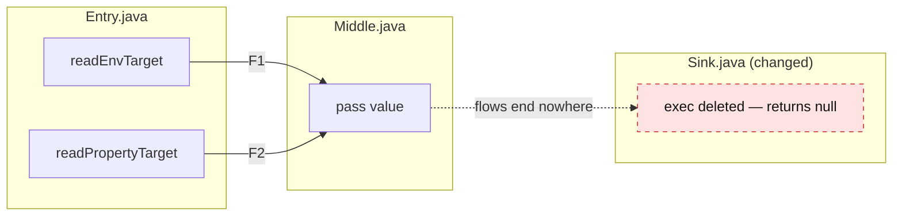

**Result: green banner.** Both findings disappear; nothing is reported.

### Case 9 — add a route in the middle (surprise)

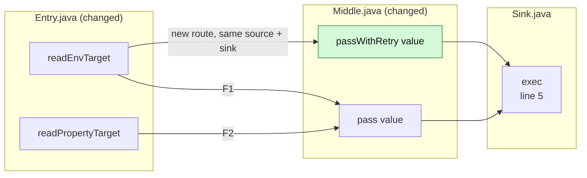

**Result: green banner — NOT reported.** The `significant_full_path` fingerprint keys on the significant steps of source and sink; an alternate route between an existing pair is not a new flow. Good for noise, worth knowing for coverage.

### Case 10 — technology set changes (baseline loss, the point-2 proof)

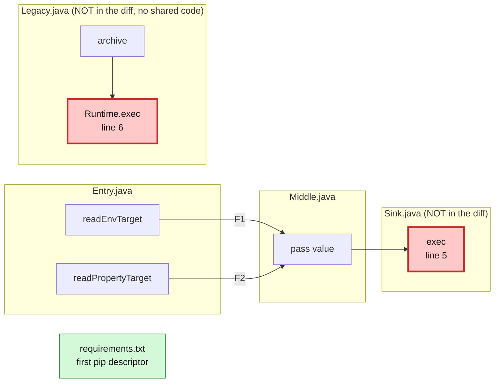

**Result: EVERYTHING is reported — `Sink.java:5` and the canary `Legacy.java:6`, plus the `requests` CVEs.** The source branch now detects `Pip`, the target branch detects no technology, `SearchTargetResultsByRelativePath` refuses the match, and the SAST scan silently runs with no baseline: the whole tree is "new". The changed file shares no code with either finding.

### Case 11 — sink line shift

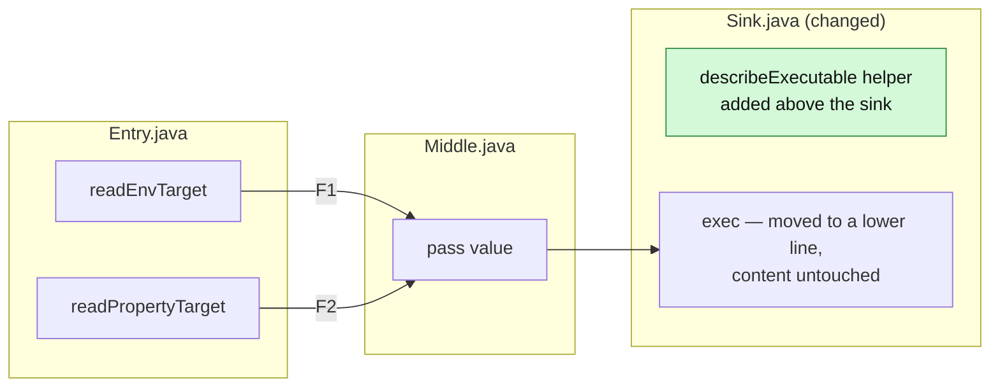

**Result: green banner.** The finding's *location* moved but the flow content did not; the fingerprint survives.

### Case 12 — rename a file on the flow path

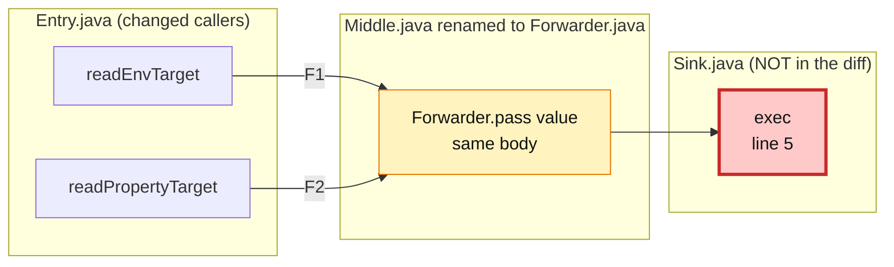

**Result: findings resurface at `Sink.java:5` — untouched file.** The class name is part of the flow content, so a rename re-fingerprints every flow through it.

## Observed results (2026-08-20, frogbot v3.5.0, tokyoshiftleft)

The runs were repeated twice. **First pass (violations mode):** a `gitRepository` watch with a
`sast` policy was bound; the scanner behaved identically, but no SAST violation was ever generated
server-side (watch violation count stayed 0 across all 12 PRs) and with a watch present Frogbot
posts violations only — so every PR got the green banner even when the scan found new issues.
Frogbot v3 also ignores the profile's `include_vulnerabilities_and_violations` flag (no code reads
it in the PR flow), so nothing could force findings to display. That is a finding in itself. The
watch was then removed and everything re-ran in vulnerabilities mode — the results below are what
you see on the PRs now.

Comment placement: a finding whose file is part of the diff arrives as an **inline review comment**;
a finding on an untouched file arrives as a **regular PR comment** ("at `<file>` (line N)").

| PR | Case | What the PR shows | Hypothesis |
|----|------|-------------------|------------|
| 1 | control-unrelated | green banner | ✅ |
| 2 | control-new-vuln | inline comment on `NewVuln.java:6` | ✅ |
| 3 | add-source | comment: finding at `Sink.java:5` — untouched file | ✅ |
| 4 | remove-source | green banner | ✅ |
| 5 | modify-middle | comment: finding at `Sink.java:5` — untouched file, pre-existing flow resurfaced | ✅ |
| 6 | benign-middle | green banner | ✅ |
| 7 | modify-sink | inline comment on `Sink.java:5` | ✅ |
| 8 | remove-sink | green banner | ✅ |
| 9 | add-flow-middle | green banner — a new route between an existing source and sink is **not** a new finding | ❌ (surprise) |
| 10 | tech-change | "found 5 issues": SAST at `Sink.java:5` **and the canary `Legacy.java:6`** + 3 SCA CVEs for `requests` | ✅ **baseline loss proven** |
| 11 | sink-line-shift | green banner | ✅ |
| 12 | rename-middle | comment: finding at `Sink.java:5` — untouched file | ✅ |

### Case 10 — the baseline-loss mechanism (debug log)

```
Searching for target '' with technology 'Pip' in results with base path '/tmp/jfrog.cli.temp.-…'
Comparing target /tmp/jfrog.cli.temp.-… [unknown], relative: ''
No target found
```

and no `Diff mode - SAST results to compare provided` line: the source branch detects `Pip`, the
target branch detects no technology, `SearchTargetResultsByRelativePath` refuses the match, and the
SAST scan silently runs with no baseline — so the whole tree is "new", including `Legacy.java`,
which no PR in this repository ever touches. Case 5's log shows the healthy path (`Found target` →
`Diff mode - SAST results to compare provided`). One `requirements.txt` is the entire trigger.
